# P4a : Analyse de performances de différentes structures

[Grille d'évaluation P4a](https://docs.google.com/spreadsheets/d/1Ki0FJpb8fR_yDCS4hYwoEPKs_Ap4UxTZ5MOpkdj0GVU/edit#gid=0)

## Problème

Lors du développement d'une application en Java (ou dans un autre langage), nous utilisons très régulièrement des `Collections` pour stocker des données. Cependant, chaque implémentation de cette interface possède des avantages et des inconvénients, tout dépend de l'utilisation que l'on va en faire.
Notre but est de comparer le temps d'éxécution et d'utilisation mémoire de différentes collections afin de voir laquelle est la plus performante.

Pour ce faire, nous allons tester 3 opérations différentes :
- L'*insertion* d'un élément
- L'*accès* à un élément
- La *suppression* d'un élément

Nous avons choisi de réaliser nos tests sur les structures suivantes de l'interface `ICollection` :
- `ArrayList`
- `LinkedList`
- `HashSet`

Afin d'observer les différences de temps d'exécution et d'utilisation mémoire, nous allons faire jouer les paramètres suivants afin
de pouvoir choisir laquelle répond le mieux à notre problème :
- Le nombre de tests par opération
- La taille de notre structure

## Dispositif expérimental

### Application

1. [Code source de l'application Java](src/java/Main.java)

```
java Main <interface> <operation> <size>
```
```
interface:
    0 => ArrayList
    1 => LinkedList
    2 => HashSet

operation:
    0 => Add
    1 => Contains
    2 => Remove
 ```
 
2. [Code source du script Bash](src/benchmark.sh)
3. [Code source des scripts R](src/plots)

### Environnement de test

Nous avons effectués nos tests sur notre machine personnelle, voici le résumé des informations tirées de [`/proc/cpuinfo`](data/cpuinfo.txt) :
```
model name	: Intel(R) Core(TM) i3-4100M CPU @ 2.50GHz
cpu MHz		: 798.197
cache size	: 3072 KB
cpu cores	: 2
```

### Description de la démarche systématique

```
./run-all.sh
  -> javac Main.java : compile le code Java
  -> ./src/benchmark.sh : lance la batterie de tests contre le programme Java (compilé)
  -> Rscript ./src/plots/main.r : génère les graphiques à partir des données
```

## Résultats préalables

### Temps d'exécution

| Opération            | ArrayList                 | LinkedList                | HashSet                   | Comparaison               |
|----------------------|---------------------------|---------------------------|---------------------------|---------------------------|
| Insertion            | 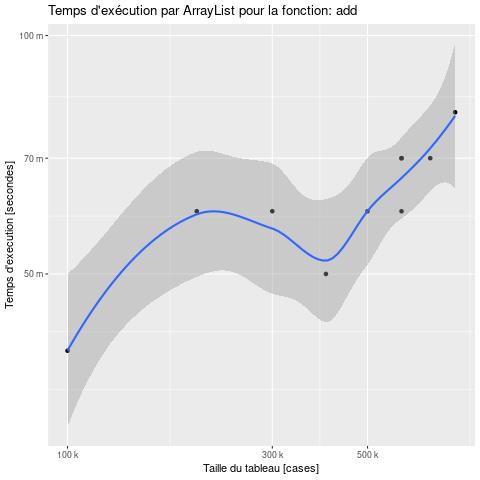 | 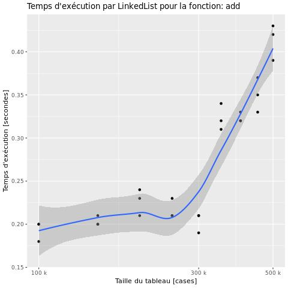 | 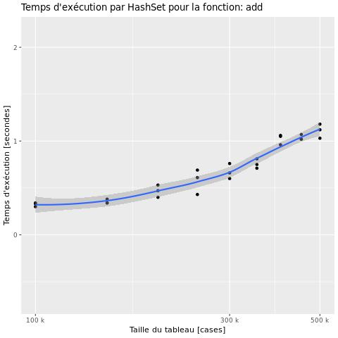 | 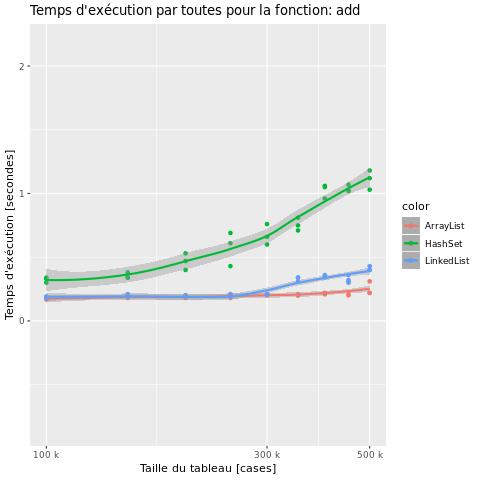 |
| Accès                | 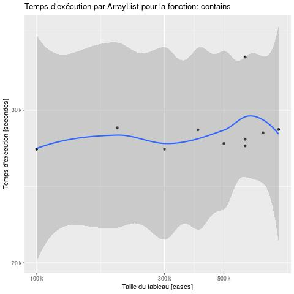 | 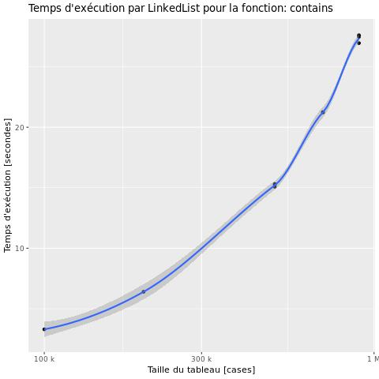 |  | 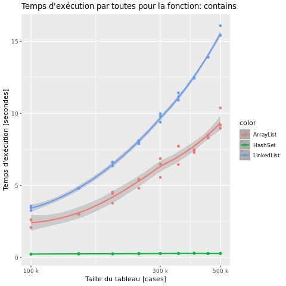 |
| Suppression          | 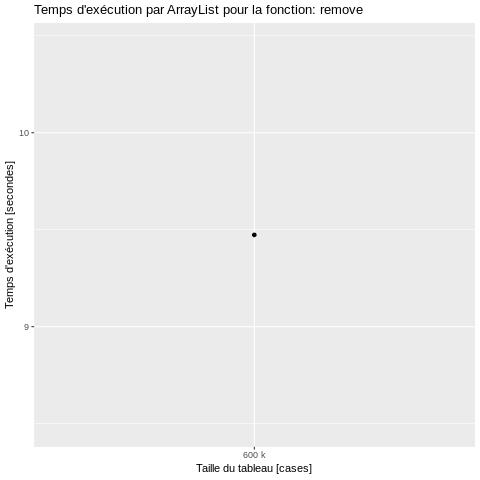 | 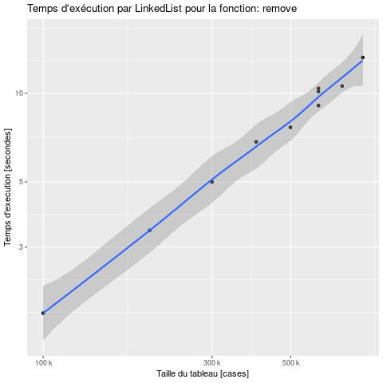 | 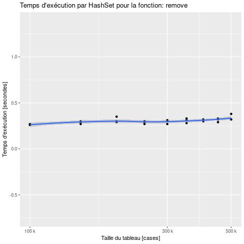 | 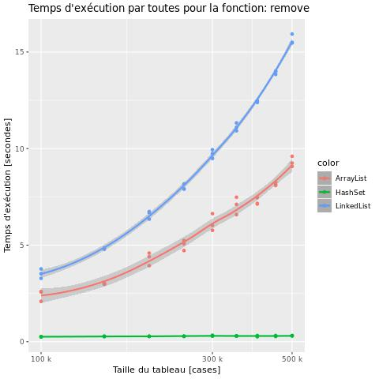 |
| Vue d'ensemble       | 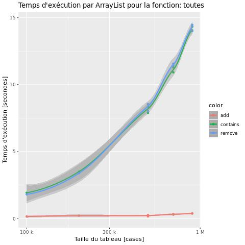 | 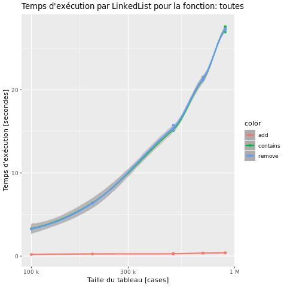 | 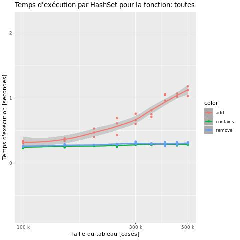 |                          |

### Consommation mémoire

| Opération            | ArrayList                 | LinkedList                | HashSet                   | Comparaison               |
|----------------------|---------------------------|---------------------------|---------------------------|---------------------------|
| Insertion            | 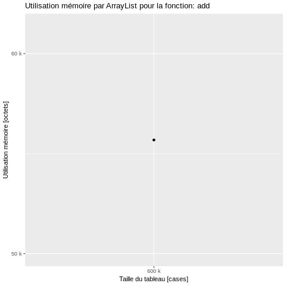 |  | 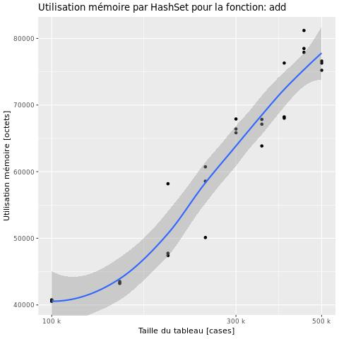 | 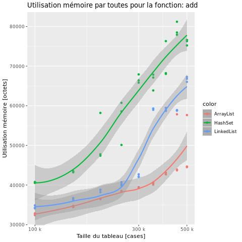 |
| Accès                |  | 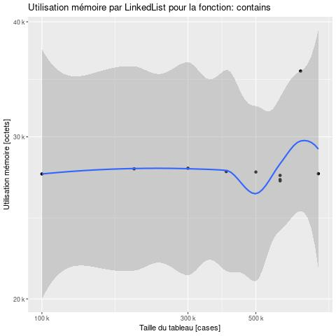 | 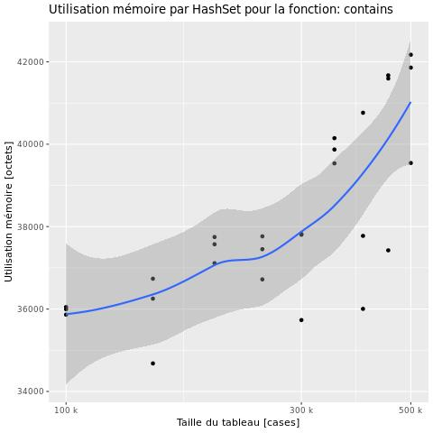 | 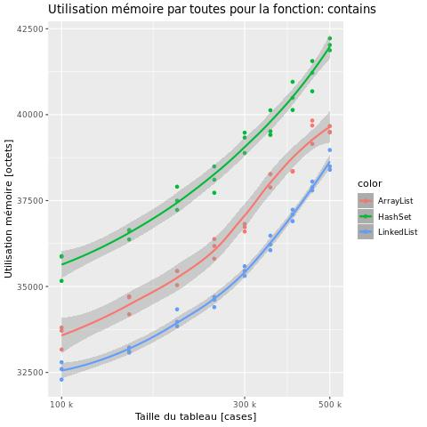 |
| Suppression          | 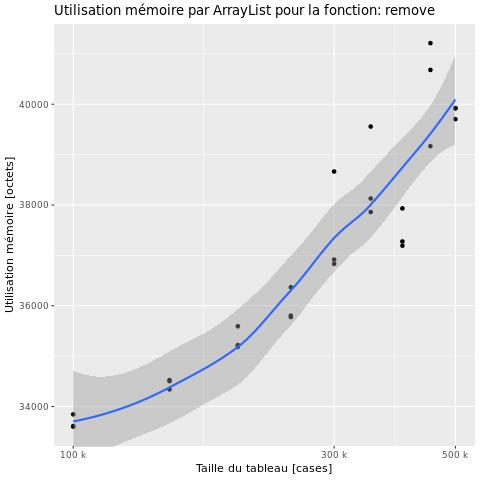 | 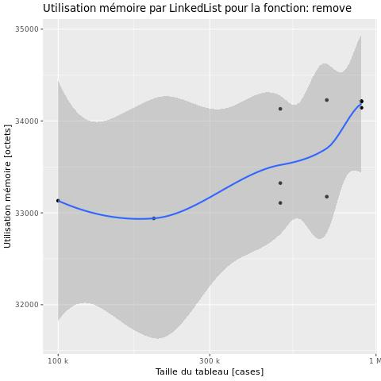 | 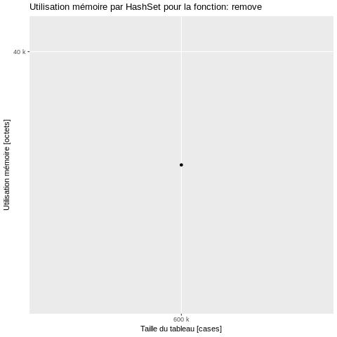 | 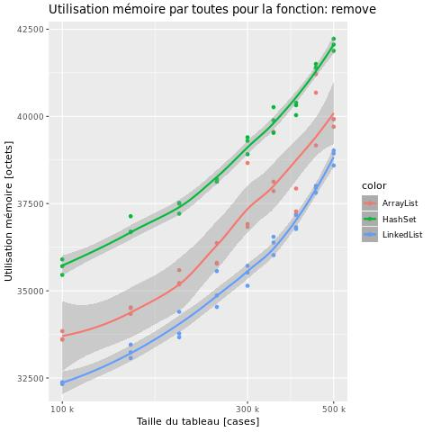 |
| Vue d'ensemble       | 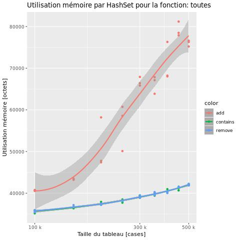 | 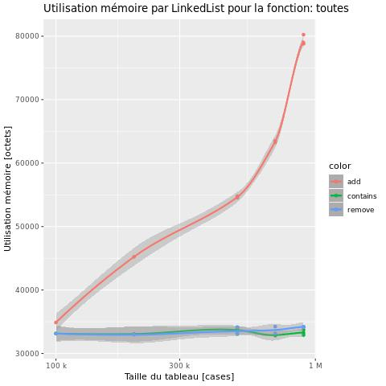 | 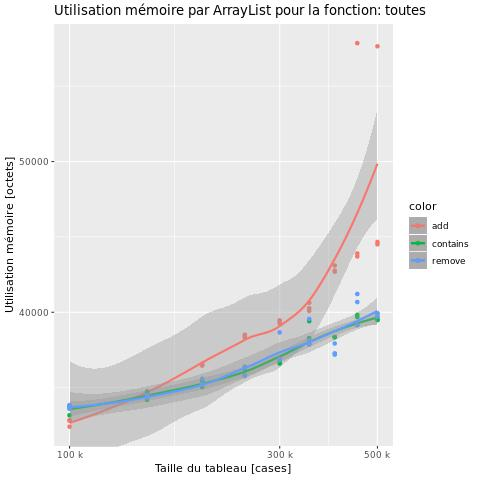 |                          |

### Analyse des résultats préalables

En regardant les graphiques générés, nous pouvons de suite remarquer que le temps d'éxécution et la consommation mémoire sont totalements différents selon la structure.

- Au niveau du temps d'éxécution, le `HashSet` est largement plus rapide que les deux autres structures pour l'accès et la suppression, cependant il est moins rapide pour l'insertion. <br/>
De plus, l'`ArrayList` est légèrement plus performante que la `LinkedList` sur les trois opérations.

- Au niveau de la consommation mémoire, c'est l'inverse puisque c'est le `HashSet` qui est le plus gourmand, peu importe l'opération réalisée.<br/>
Pour l'accès et la suppression, la `LinkedList` est un peu plus rapide que l'`ArrayList` mais quand il s'agit d'insérer des éléments la consommation mémoire de la liste chaînée explose à partir d'un certain nombre d'éléments.

### Discussion des résultats préalables

Le `HashSet` est beaucoup plus rapide que les deux autres structures étudiées pour l'accès et la suppression car les valeurs qu'il contient son triées. Cependant, cela implique qu'il met plus de temps à insérer un élément car il doit réaliser un certain nombre de comparaisons afin de trouver à quel position l'élément doit être inséré. <br/>
Cela va également augmenter drastiquement sa consommation mémoire, ce qui est probablement dû à la classification des données.

Quant à la `LinkedList`, elle crée des maillons à chaque fois qu'on souhaite insérer un nouvel élément, c'est donc pour cela qu'elle devient rapidement gourmande par rapport aux autres structures notamment lorsqu'elle atteint une taille assez conséquente.

## Etude approfondie

### Hypothèse

Expression précise et succincte d'une hypothèse.

### Protocole expérimental de vérification de l'hypothèse

Expression précise et succincte du protocole.

```
Suite des commandes, ou script, à exécuter pour produire les données.
```

### Résultats expérimentaux

### Analyse des résultats expérimentaux

### Discussion des résultats expérimentaux

## Conclusion et travaux futurs
