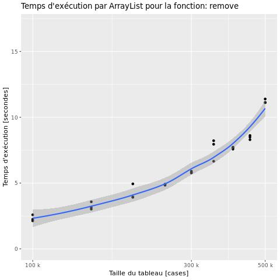
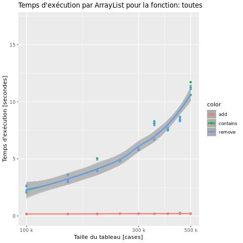
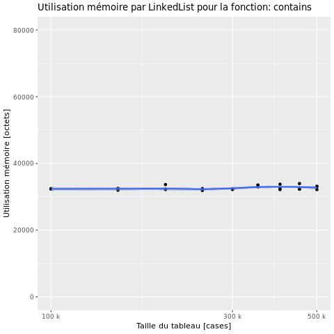
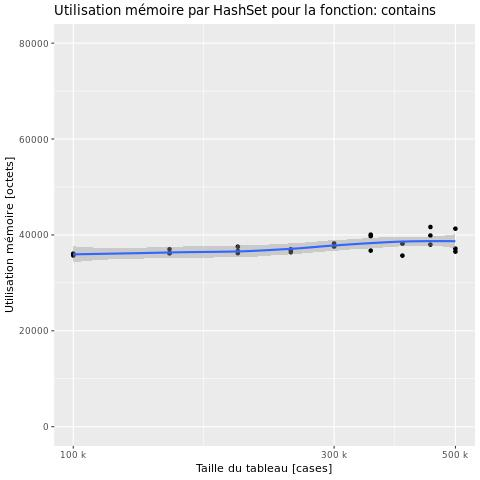
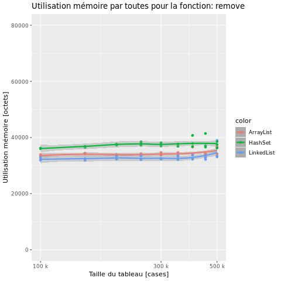
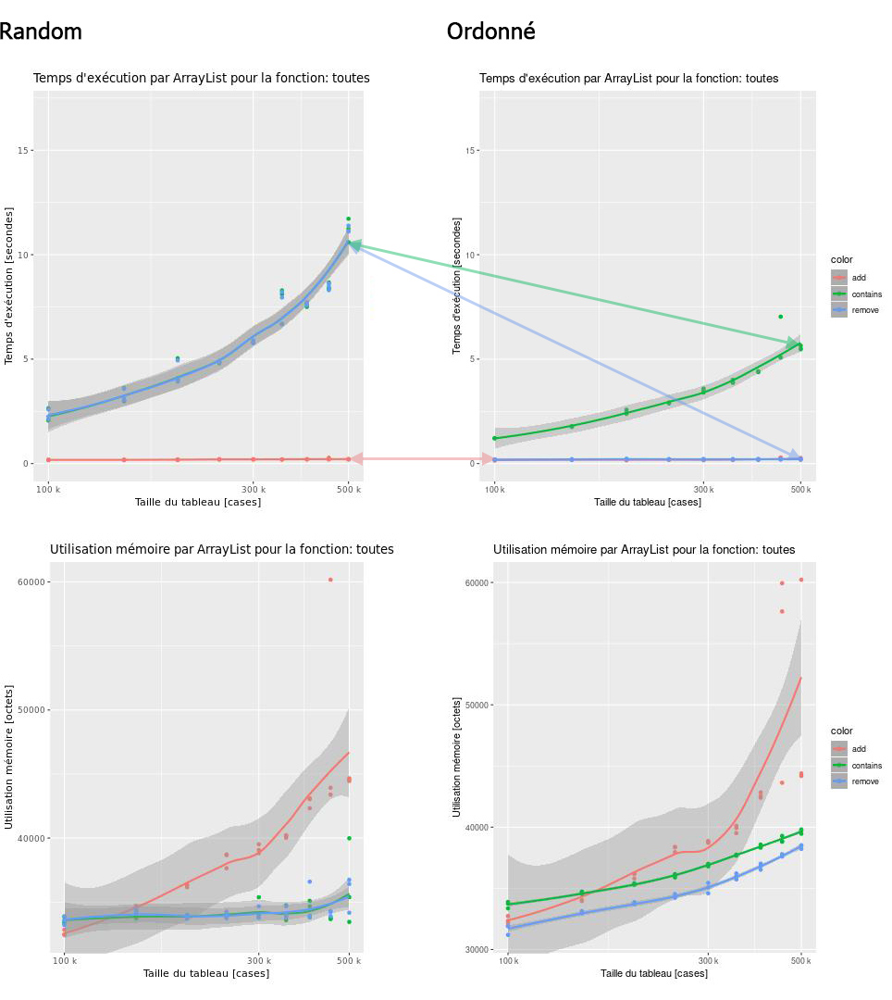
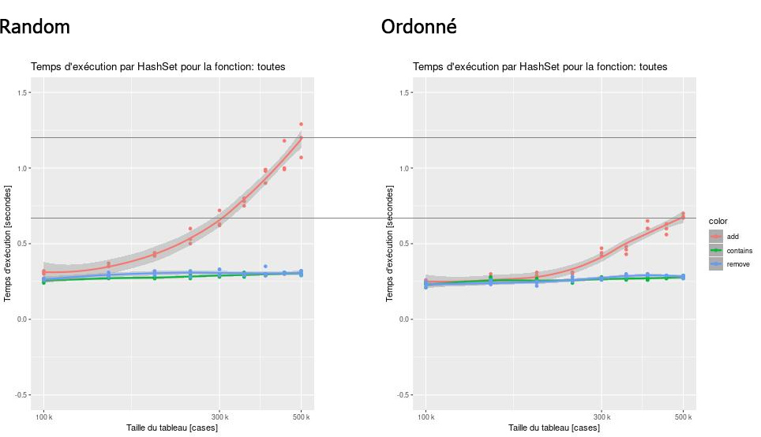

# P4a : Analyse de performances de différentes structures

[Grille d'évaluation P4a](https://docs.google.com/spreadsheets/d/1Ki0FJpb8fR_yDCS4hYwoEPKs_Ap4UxTZ5MOpkdj0GVU/edit#gid=0)

## Problème

Lors du développement d'une application en Java (ou dans un autre langage), nous utilisons très régulièrement des `Collections` pour stocker des données. Cependant, chaque implémentation de cette interface possède des avantages et des inconvénients, tout dépend de l'utilisation que l'on va en faire.
Notre but est de comparer le temps d'éxécution et d'utilisation mémoire de différentes collections afin de voir laquelle est la plus performante.

Pour ce faire, nous allons tester 3 opérations différentes :
- L'*insertion* d'un élément
- L'*accès* à un élément
- La *suppression* d'un élément

Nous avons choisi de réaliser nos tests sur les structures suivantes de l'interface `ICollection` :
- `ArrayList`
- `LinkedList`
- `HashSet`

Afin d'observer les différences de temps d'exécution et d'utilisation mémoire, nous allons faire jouer les paramètres suivants afin
de pouvoir choisir laquelle répond le mieux à notre problème :
- Le nombre de tests par opération
- La taille de notre structure

## Dispositif expérimental

### Application

1. [Code source de l'application Java](src/java/Main.java)

```
java Main <interface> <operation> <size>
```
```
interface:
    0 => ArrayList
    1 => LinkedList
    2 => HashSet

operation:
    0 => Add
    1 => Contains
    2 => Remove
 ```
 
2. [Code source du script Bash](src/benchmark.sh)
3. [Code source des scripts R](src/plots)

### Environnement de test

Nous avons effectués nos tests sur notre machine personnelle, voici le résumé des informations tirées de [`/proc/cpuinfo`](data/cpuinfo.txt) :
```
model name	: Intel(R) Core(TM) i3-4100M CPU @ 2.50GHz
cpu MHz		: 798.197
cache size	: 3072 KB
cpu cores	: 2
```

### Description de la démarche systématique

```
./run-all.sh
  -> javac Main.java : compile le code Java
  -> ./src/benchmark.sh : lance la batterie de tests contre le programme Java (compilé)
  -> Rscript ./src/plots/main.r : génère les graphiques à partir des données
```

## Résultats préalables

### Temps d'exécution

| Opération            | ArrayList                 | LinkedList                | HashSet                   | Comparaison               |
|----------------------|---------------------------|---------------------------|---------------------------|---------------------------|
| Insertion            | <br/>*Zoom de 0 à 2s* | <br/>*Zoom de 0 à 2s* | <br/>*Zoom de 0 à 2s* | <br/>*Zoom de 0 à 2s* |
| Accès                |  |  | <br/>*Zoom de 0 à 2s* |  |
| Suppression          |  |  | <br/>*Zoom de 0 à 2s* |  |
| Vue d'ensemble       |  |  | <br/>*Zoom de 0 à 2s* |                          |

### Consommation mémoire

| Opération            | ArrayList                 | LinkedList                | HashSet                   | Comparaison               |
|----------------------|---------------------------|---------------------------|---------------------------|---------------------------|
| Insertion            |  |  |  |  |
| Accès                |  |  |  |  |
| Suppression          |  |  |  |  |
| Vue d'ensemble       |  |  |  |                          |

### Analyse des résultats préalables

En regardant les graphiques générés, nous pouvons de suite remarquer que le temps d'éxécution et la consommation mémoire sont totalements différents selon la structure.

- Au niveau du temps d'éxécution, le `HashSet` est largement plus rapide que les deux autres structures pour l'accès et la suppression, cependant il est moins rapide pour l'insertion. <br/>
De plus, l'`ArrayList` est légèrement plus performante que la `LinkedList` sur les trois opérations.

- Au niveau de la consommation mémoire, c'est l'inverse puisque c'est le `HashSet` qui est le plus gourmand, peu importe l'opération réalisée.<br/>
Pour l'accès et la suppression, la `LinkedList` est un peu plus rapide que l'`ArrayList` mais quand il s'agit d'insérer des éléments la consommation mémoire de la liste chaînée explose à partir d'un certain nombre d'éléments.

### Discussion des résultats préalables

Le `HashSet` est beaucoup plus rapide que les deux autres structures étudiées pour l'accès et la suppression car les valeurs qu'il contient son triées. Cependant, cela implique qu'il met plus de temps à insérer un élément car il doit réaliser un certain nombre de comparaisons afin de trouver à quel position l'élément doit être inséré. <br/>
Cela va également augmenter drastiquement sa consommation mémoire, ce qui est probablement dû à la classification des données.

Quant à la `LinkedList`, elle crée des maillons à chaque fois qu'on souhaite insérer un nouvel élément, c'est donc pour cela qu'elle devient rapidement gourmande par rapport aux autres structures notamment lorsqu'elle atteint une taille assez conséquente.

## Etude approfondie

### Hypothèse

Dans les tests précédents, nous avons remarqué que les performances de la structure `HashSet` sont vraiment intéressantes et rapides. Bien que cela consomme un peu plus de mémoire que les autres structures, c'est négligeable car le temps d'éxécution reste très rapide : comme montré ci-dessous, on passe de 10 secondes d'exécution (meilleur des cas) à 200ms pour les opérations `contains` et `remove` pour une taille de **500.000** éléments.


Mais dans le meilleur des cas, avec une taille de **500.000** éléments, on passe d'une consommation mémoire d'environ `35Ko` à environ `76Ko`. Cela correspond à une différence d'environ `41Ko`, ce qui reste relativement négligeable dans notre cas.

Nous soutaitons donc faire une hypothèse sur le triage des données. Si nous insérons, recherchons et supprimons des données ordonnées, serons-nous capables d'effectuer ces opérations beaucoup plus rapidement ?

### Protocole expérimental de vérification de l'hypothèse

Après adaptation du code java pour avoir des données ordonnées, nous avons la différence suivante entre le code original et le nouveau, avec `i`, une suite de valeur relative à la taille `(i = i + 1)` :

```diff
<             c.add(random.nextInt());
>             c.add(i);
---
<             c.contains(random.nextInt());
>             c.contains(i);
---
<             c.remove(random.nextInt());
>             c.remove(i);
---
```

Nous avons simplement adapté nos code sources pour le nouveau cas. Il suffit de lancer notre nouveau script bash comme ci-dessous, et il fera la liste d'actions suivantes.
```
./run-hypothese.sh
  -> javac Hypothese.java : compile le code de l'hypothèse
  -> ./src/benchmark.sh -t Hypothese : lance la batterie de tests contre l'hypothèse compilée
  -> Rscript ./src/plots/main.r Hypothese : génère les graphiques à partir des données
        avec des fichiers préfixés par `Hypothese_`
```

### Résultats expérimentaux

#### 1 — ArrayList


#### 2 — HashSet


### Analyse des résultats expérimentaux
Tout d'abord, nous avons totalement ignoré le cas du `LinkedList` qui a bien été
traité par nos scripts mais qui, sans aucune surprise, ne reçoit quasiment aucun
gain de performance (temps et utilisation mémoire).

Ensuite, nous pouvons observer un gros changement positif dans le cas de la
structure `ArrayList`, qui voit le temps des `contains` divisé par deux (de 12
secondes à 6 secondes) et le temps de l'opération `remove` s'est totalement
effondrée de 12 secondes à environ 100ms, tout cela dans le cas de collections
de `500.000` éléments.

En plus de cela, nous observons une diminution de l'utilisation mémoire assez
importante, qui passe de `54Ko` à `47Ko` (`7Ko` gagnés) sur une collection de
`500.000` éléments.

Mais, ce n'est pas tout, l'`HashSet` est toujours loin devant
l'`ArrayList`, avec nos changements, il divise son temps d'exécution par deux
(de 1.3 secondes à 0.7 secondes). Quant à l'utilisation mémoire, elle est
quasiment identique.

### Discussion des résultats expérimentaux
L'`ArrayList` passe désormais d'un `remove` en `O(n)` à du `O(1)`, ce qui est
très surprenant. On pourrait imaginer que l'implémentation Java de `ArrayList`
fait qu'il regarde de suite dans la case `i` lors de la suppression, ce qui
pourrait justifier une telle rapidité.

Mais dans le cas du `contains`, il semblerait qu'il continue à parcourir les
éléments de un à un jusqu'à ce qu'il trouve le `i` recherché.
Mais le `contains` étant deux fois plus rapide dans le cas d'une suite
`(i = i + 1)`, on pourrais assumer que cela est dû au cache du processeur qui
peut parcourir rapidement une liste ordonné car il serait capable de charger un
ensemble de valeurs rapidement avec une forte probabilité que le nombre
recherché soit dans le cache.

Quant à l'utilisation mémoire de `ArrayList`, il est difficile de s'exprimer.
Cela pourrait être dû au fait que les valeurs aléatoire sont souvents codées sur
plusieurs octets. L'implémentation Java des entiers fait probablement que cela
prenne moins de place en mémoire lorsqu'on manipule des entiers de 2 à 16
octets. Ce qui pourrait partiellement justifier la différence, mais pas un total
de `7Ko`, il se passe définitivement quelque chose dans l'implémentation Java
qui diminue la consommation mémoire dans notre cas.

Dans le cas du `HashSet` nous assumons qu'il génère moins de relations entre les
valeurs, moins de méta-données qui classifient les valeurs car elles sont
relativement proches les unes des autres, le classement doit donc se voir plus
efficace sur une suite avec un pas non-exponentiel.

La recherche et la suppression, ne sont **pas du tout** affectées,
car la méthode de recherche doit être exactement la même, la classification doit
donc avoir toujours la même effacitée qu'avant, tout comme pour le stockage qui
est lui aussi n'est pas affecté.

## Conclusion et travaux futurs
La rapidité impressionnante de la suppresion dans l''`ArrayList` qui passe d'un
temps d'exécution `O(n)` à du `O(1)` dans le cadre d'une suite `(i = i + 1)`
pourrait être fausse dès que le pas est différent de `1`. On pourrait donc
expérimenter un autre pas (ex. : 1000 ou 10). Une influence sur ce paramètre
pourrait révéller des choses intéressante.

De plus, nous pourrions expérimenter d'autres structure conçues pour des données
ordonnées qui pourraient se révéler plus efficace que `HashSet` qui est
spécialisé dans la recherche d'unicité et non pas d'ordonnement.

Et en addition à tout cela, on pourrait essayer de partir de données avec un
espace réservé dès la création de nos structure en fonction de la taille passée
et attendue ; ce qui pourrait améliorer les temps et permettre d'avoir plus de
valeurs en cache, car il se pourrait que notre structure ne soit pas capable
d'avoir toutes les valeurs à la suite dans la mémoire en fonction de l'espace
alloué au début.

